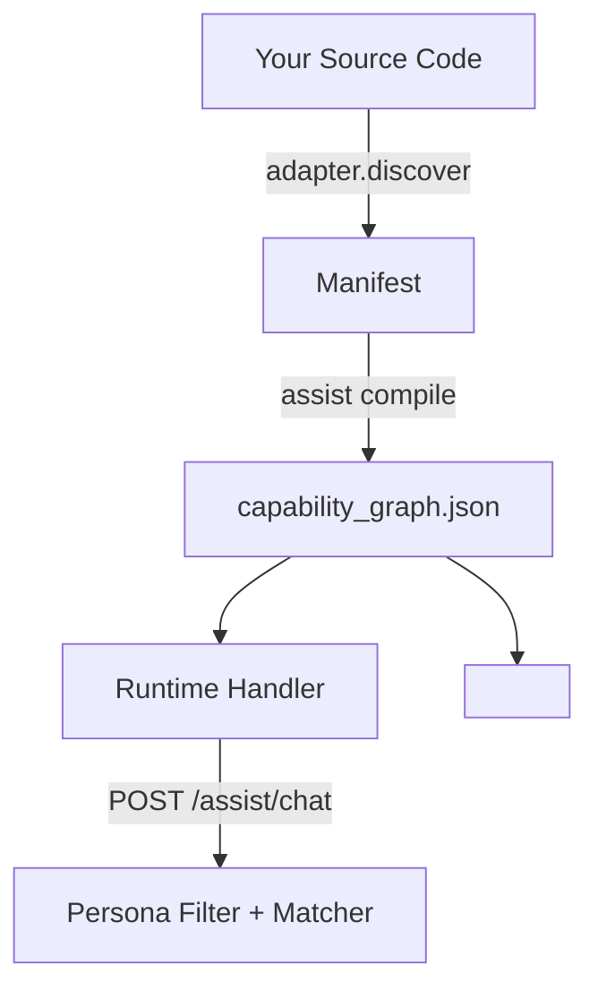

<div align="center">
  
</div>

# Wayfinder

**An open-source framework that adds intelligent, zero-annotation AI assistance to any SaaS product.**

[](https://opensource.org/licenses/MIT)


Wayfinder helps new users become productive in your application the moment they log in — without training videos, lengthy onboarding flows, or hand-authored help content.

It automatically understands your application’s structure (pages, actions, fields, and permissions) and delivers two complementary experiences:

- **Proactive onboarding** — Role-aware checklists and guided tours that walk users through their actual job on first login.
- **Reactive assistant** — A contextual chat widget that answers “How do I…?” questions by guiding users to the exact page, tab, and field — and can drive the UI when appropriate.

Everything is powered by a single **capability graph** that is automatically derived from your codebase.

## Why Wayfinder?

Most SaaS products still rely on:
- Static documentation
- Generic product tours
- Expensive customer success teams

Wayfinder flips this model. Instead of forcing users to learn your product, the product learns how to help the user — directly from the code you already write.

### Key Benefits

- ✅ **Zero annotation by default** — Add it to an existing codebase and it works.
- ✅ **Drift-proof** — If you ship a new page or field without recompiling, CI fails.
- ✅ **Proactive + Reactive** — One system handles both guided onboarding and on-demand help.
- ✅ **Works on the real UI** — Tours and guidance happen on your actual interface, not screenshots.
- ✅ **Secure by design** — Strict persona-based filtering, confidence gates, and a kill switch for agentic actions.
- ✅ **Framework-friendly** — JSON core + first-class Next.js support (more adapters coming).
- ✅ **Provider agnostic** — OpenAI, Anthropic, Ollama (local), or mock.

## Quick Start (Demo)

The fastest way to see it in action:

```bash
pnpm install
pnpm --filter @wayfinder/core build
cd examples/nextjs-demo
pnpm dev
```

Open http://localhost:3000 and try the floating chat widget.

Ask questions like:
- “How do I log a donor offer?”
- “Where do I enter terminal creatinine?”

## Adding Wayfinder to Your SaaS

Wayfinder is designed to be added to **existing** applications with minimal changes.

See the full guide:

→ **[Integration Guide →](./docs/integration.md)**

High-level steps:

1. Run the CLI to initialize: `pnpm --filter @wayfinder/cli dev:assist -- init .`
2. Run discovery + compile to generate the capability graph.
3. Mount the `<assist-widget>` (Web Component or React wrapper).
4. Add a thin API route that calls the runtime handler.
5. Commit the generated `capability_graph.json` (and cache).

## How It Works



Wayfinder uses a three-stage pipeline:

1. **Discover** (deterministic) — Walks your routes, components, and RBAC to produce a manifest.
2. **Compile** (LLM-powered, cached) — Generates human-friendly descriptions, steps, and suggested onboarding sequences. Only changed files are recompiled thanks to source hashing.
3. **Runtime** — Serves a lightweight `POST /assist/chat` endpoint that combines deterministic matching with a small LLM call, always filtered by the user’s persona.

The result is a committed `capability_graph.json` that both the widget and your backend consume.

For a deeper explanation, see:

- [Concepts](./docs/concepts.md)
- [Architecture](./docs/architecture.md)

## Documentation

| Topic                          | Link                              |
|--------------------------------|-----------------------------------|
| Getting Started                | [docs/getting-started.md](./docs/getting-started.md) |
| Adding to Your Application     | [docs/integration.md](./docs/integration.md) |
| Core Concepts                  | [docs/concepts.md](./docs/concepts.md) |
| Architecture & Pipeline        | [docs/architecture.md](./docs/architecture.md) |
| CLI Reference                  | [docs/cli.md](./docs/cli.md) |
| FAQ                            | [docs/faq.md](./docs/faq.md) |
| Security & Privacy             | [docs/security.md](./docs/security.md) |
| Roadmap                        | [ROADMAP.md](./ROADMAP.md) |
| Development & Contributing     | [docs/development.md](./docs/development.md) |

Full documentation lives in the [`docs/`](./docs) folder.

## Packages

This is a monorepo containing the following main packages:

| Package                    | Description                                      |
|---------------------------|--------------------------------------------------|
| `@wayfinder/core`         | Core schema, graph validation, runtime contract, and reference handler |
| `@wayfinder/cli`          | `assist` CLI (`init`, `discover`, `compile`, `gate`) |
| `@wayfinder/providers`    | LLM provider abstraction (OpenAI, Anthropic, Ollama, mock) |
| `@wayfinder/widget`       | Framework-agnostic `<assist-widget>` Web Component |
| `@wayfinder/adapter-nextjs` | Next.js adapter (App Router discover, React wrapper, command bus) |

Each package has its own README with more details.

## Current Status

Wayfinder is under active development. The core vision is documented in the [docs/](./docs) folder.

The flagship experience (Next.js + zero-annotation) is the current focus.

## License

MIT

---

**Wayfinder** — Make your SaaS instantly understandable.

---

<p align="center">
  <a href="https://github.com/aniruth/hobby/saas-ai-assist/stargazers">
    
  </a>
</p>

*If Wayfinder helps you, please consider starring the repo — it helps others discover it!*